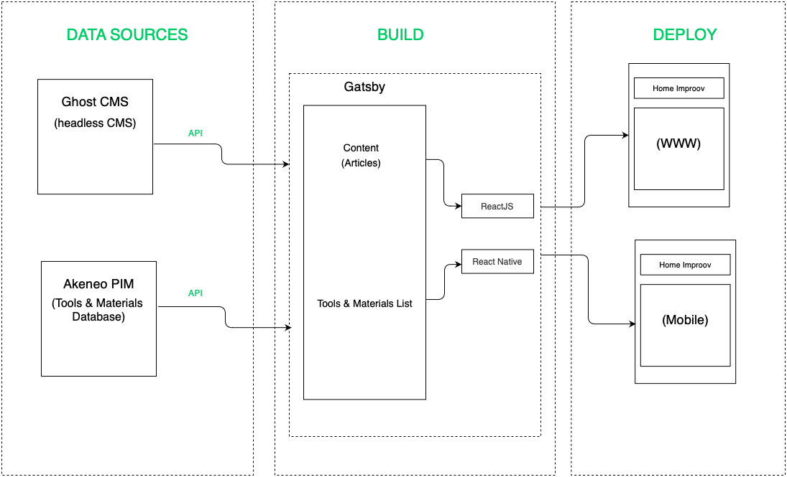
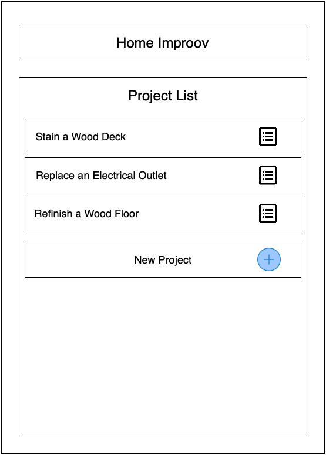
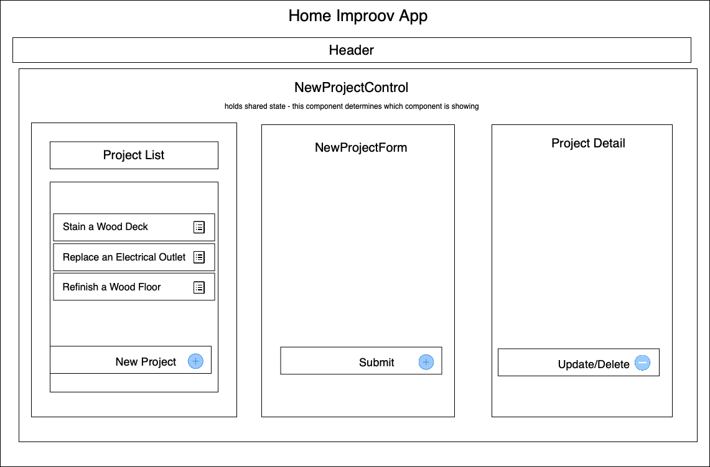

<p align="center">
  <a href="https://homeimproov.com">
    
  </a>
</p>
<h2 align="center">
  
</h2>


### Home Improov v5.0
_Users will be able to create a project and add a list of Tools & Materials for said project._

#### Joseph Pearce


## Project Considerations


_Research React Frameworks.  Although I will start with a MVP, my project will require a certain level of complexity that will benefit from a framework.  Based on these two articles I chose to use Gatsby but I may need to consider Next.js if the site grows significantly in page or user count._


_[Next.js vs. GatsbyJS: A developer’s perspective](https://blog.logrocket.com/next-js-vs-gatsbyjs-a-developers-perspective/)_

 _[Gatsby vs Next.JS - What, Why and When?](https://dev.to/jameesy/gatsby-vs-next-js-what-why-and-when-4al5)_

 _Gatsby is a React framework that can work in a hybrid fashion - serve a static and also re-hydrates the React on the page on the client side. This will fit my use case because Home Improov will include both static and dynamic pages.  Gatsby can feed the site content and list items via an API._

<br />
<br />
    
## Overall Scope of Project

_Home Improov will allow users to source the best of DIY home improvement articles.  It will serve as an aggregator by selectively sourcing the best how to articles.  In order to facilitate this feature a Ghost CMS will be used for editors to input the articles.  The article content will then be pushed to the Home Improov React app via an API.  Each article will include a Tools & Materials list which will be managed in an Akeneo PIM database and populated in the app via an API. The user will be able to automagically add the Tools & Materials list as a new Project by selecting an "Add To Projects" button._ 




<br />
<br />

## MVP Wireframe

_The MVP focuses on the WWW version of the app which will include full CRUD functionality_

## User Stories 

* User can read a list of projects
* User can add a project
* User can mark any project as completed
* User can delete any project
* User can edit any project
* User view a specific subset of projects: All projects, only the active project, or only the completed projects
* User can add Tools to a Project
* The tools list will have full CRUD functionality
* User can add Materials to a Project
* The materials list will have full CRUD functionality




## Component Diagram




<br />
<br />

## Project Proposal

##### List the absolute minimum features the project requires to meet this purpose or goal: 
* User can read a list of projects
* User can add a project
* User can mark any project as completed
* User can delete any project
* User can edit any project
* User view a specific subset of projects: All projects, only the active project, or only the completed projects

##### What tools, frameworks, libraries, APIs, modules and/or other resources (whatever is specific to your track, and your language) will you use to create this MVP? 
* React
* Gatsby
* HTML
* Tailwinds CSS
* Styled Components
* JavaScript

##### If you finish developing the minimum viable product (MVP) with time to spare, what will you work on next? Describe these features here: Be specific.
* Add articles - using Ghost CMS, feed content into the Home Improov application via an API
* Add a Tools & Materials list for each article. 
* Enable user to auto-add Tools & Materials list from articles

##### What additional tools, frameworks, libraries, APIs, or other resources will these additional features require?
* Ghost CMS (as headless CMS)
* Akeneo PIM (database for tools and material lists)
* API calls to pull in article content (from Ghost CMS) and tools & material list from database (Akeneo)


</br >
</br >

## Quick start

1.  **Download.**

    Use terminal to clone repo 

    ```shell
    # Clone the repo
    Home Improov https://github.com/pearcy/Home-Improov2
    ```

1.  **Install**

    Navigate into your new site’s directory and start it up.

    ```shell
    cd your folder name/
    gatsby develop
    ```

1.  **Open the source code and enjoy!**

    Your site is now running at `http://localhost:8000`


